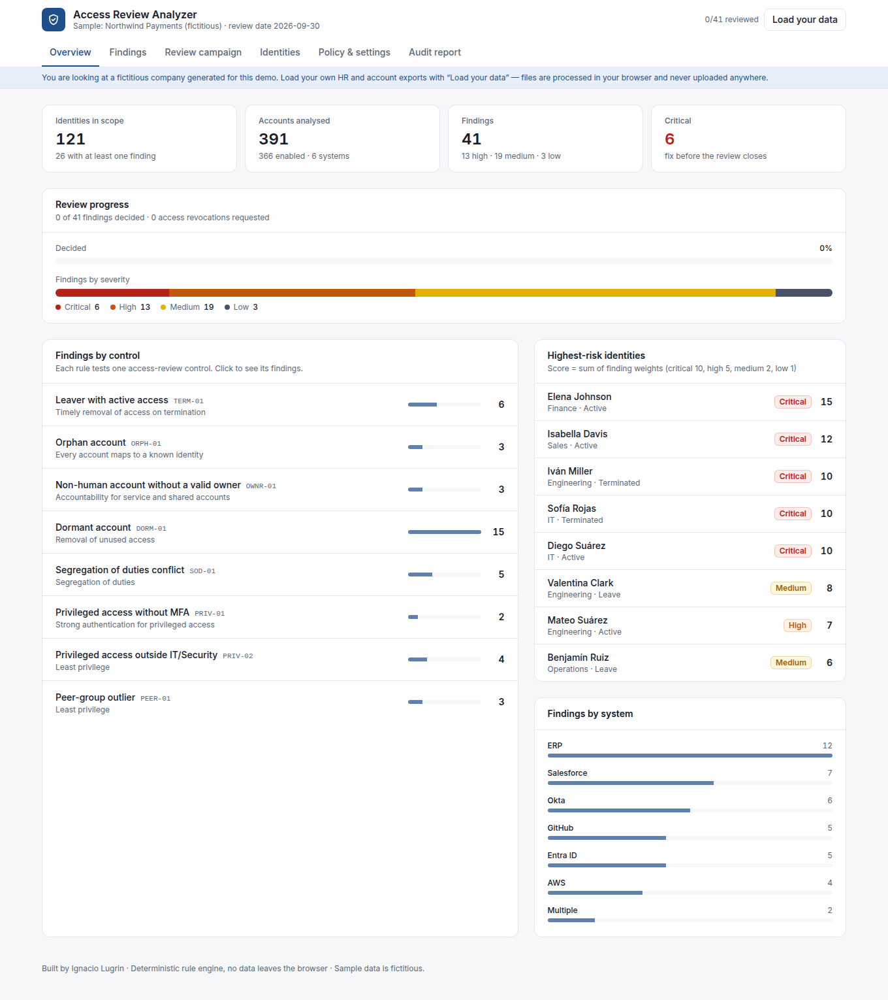
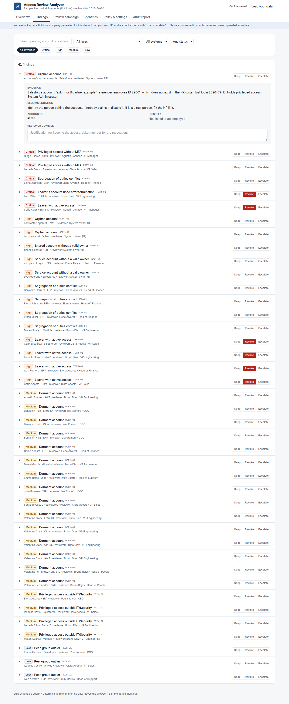

# Access Review Analyzer

A browser-based tool that runs a **user access review** — the periodic control where a company checks that everyone has exactly the access they should, no more — and produces an audit-ready report.

Load an HR roster and an export of accounts from each system. The analyzer cross-checks them with eight deterministic rules, sends each exception to the right reviewer, records Keep / Revoke / Escalate decisions, and prints the evidence an auditor asks for.



> The demo opens with **Northwind Payments**, a fictitious fintech generated by `scripts/generate-sample-data.mjs` (121 people, 391 accounts, 6 systems). No real company or person data is included.

## Why I built it

I work in Identity and Access Management and have prepared SOX access-review evidence by hand: exporting accounts, matching them against HR in spreadsheets, chasing managers for decisions and assembling screenshots. This project turns that process into a repeatable tool. The rules encode the questions an auditor actually asks.

## What it checks

| Rule | Finding | Control it supports |
|---|---|---|
| `TERM-01` | Enabled account of an employee HR marks as terminated. Critical if it was **used after** the termination date or holds admin rights | Timely removal of access on termination |
| `ORPH-01` | Human account whose employee ID does not exist in HR | Every account maps to a known identity |
| `OWNR-01` | Service or shared account with no owner, or an owner who has left | Accountability for non-human accounts |
| `DORM-01` | Enabled account unused for longer than the dormancy window (default 90 days), with a grace period for new joiners and a "suspend" recommendation for people on leave | Removal of unused access |
| `SOD-01` | One person holds both sides of a toxic pair, **evaluated across systems** (e.g. GitHub `org-owner` + AWS `AdministratorAccess`) | Segregation of duties |
| `PRIV-01` | Privileged entitlement with no MFA enrolled | Strong authentication for privileged access |
| `PRIV-02` | Privileged entitlement held outside IT/Security | Least privilege |
| `PEER-01` | Entitlement held by less than 15% of the person's department — usually left over from a previous role | Least privilege |

The policy (privileged entitlements, segregation-of-duties matrix, thresholds) lives in [`lib/policy.ts`](lib/policy.ts) as data, and the **Policy & settings** tab shows it to reviewers. Thresholds can be adjusted there, and findings recalculate instantly.

## Features

- **Overview:** exposure by severity, by control and by system; highest-risk identities; review progress.
- **Findings:** filter by severity, rule, system and decision status. Each finding shows its evidence (the source rows it is based on) and a recommendation. Includes a bulk action to revoke all pending leaver access.
- **Review campaign:** one inbox per reviewer (the employee's manager, or the system owner for unlinked accounts), sorted by pending work.
- **Identities:** every account and entitlement a person holds across systems, with privileged access highlighted.
- **Audit report:** summary, method, all exceptions with decisions and comments, and sign-off lines. Print to PDF or export to CSV.
- **Private by design:** a static site with no backend. Files are parsed in the browser and never uploaded. Decisions are saved in the browser's local storage.



## Design decisions

- **Deterministic, not AI.** Audit findings must be reproducible: the same files and settings always produce the same result, and every finding cites its source. AI is a good fit for later steps, such as drafting the message to a manager, but not for deciding what counts as an exception.
- **HR is the source of truth.** Identity status comes from HR, not from the systems being reviewed. This is how the leaver and orphan checks work.
- **No double counting.** An account already flagged as a leaver or orphan is not reported again as dormant, because one revocation fixes both.
- **Strict import.** A file with missing columns is rejected rather than half-read, and invalid rows are reported with their line number.
- **Stable finding IDs.** Reviewer decisions survive re-running the analysis with different thresholds.

## Input format

Two CSV files. Multiple entitlements go in one cell, separated by `;`. Templates: [`public/sample/hr.csv`](public/sample/hr.csv), [`public/sample/accounts.csv`](public/sample/accounts.csv).

**HR roster:** `employee_id, name, email, department, title, manager_id, status (Active | Terminated | Leave), hire_date, termination_date`

**Accounts:** `account_id, system, username, employee_id, owner_id, account_type (human | service | shared), enabled, last_login, mfa_enrolled, entitlements`

Dates use `yyyy-mm-dd`.

## Run it

Requires Node.js 20.9 or newer.

```bash
npm install
npm run dev        # http://localhost:3000
npm test           # 19 unit + integration tests (Vitest)
npm run lint
npm run build      # static site in out/
npm run generate:data   # regenerate the sample dataset (seeded, reproducible)
```

The integration test asserts that the analyzer finds **every issue planted in the sample data and nothing else**. The planted issues are commented one by one in the generator.

## Deploy

`.github/workflows/deploy.yml` lints, tests, builds and publishes to GitHub Pages on every push to `main` (set **Settings → Pages → Source: GitHub Actions**). The sub-path is injected at build time through `BASE_PATH`.

## Stack

Next.js 16 (static export) · React 19 · TypeScript · Tailwind CSS 4 · Papa Parse · Vitest

## Roadmap

- Import directly from Microsoft Entra ID (Microsoft Graph) and Okta APIs instead of CSV.
- Time-bound exceptions ("keep until" date) and reminders for pending reviewers.
- Draft reviewer notifications with an LLM, with the decision itself staying rule-based.

---

Built by **Ignacio Lugrin** — IAM analyst (Okta, Microsoft Entra ID, SailPoint, Active Directory).
